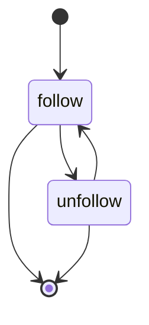
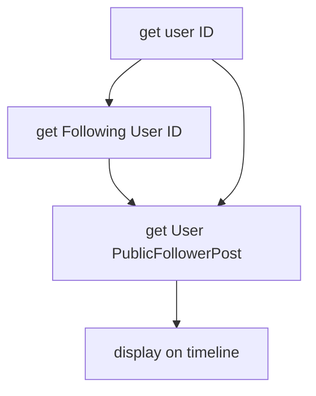
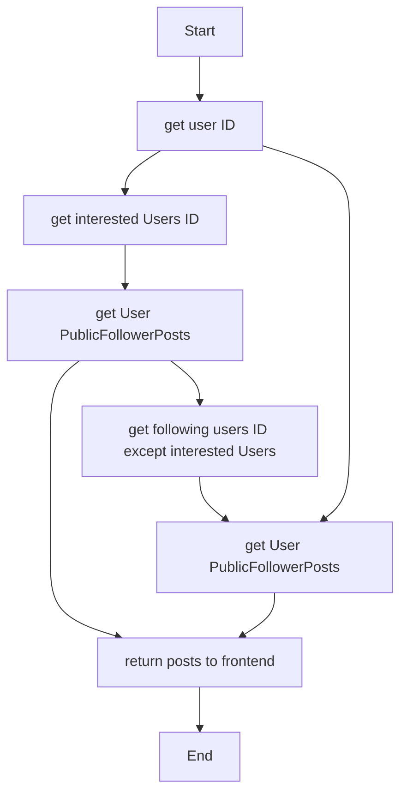

## Thử thiết kế DB có thể chạy được những chức năng của mạng xã hội như facebook

# Thử thiết kế DB có thể chạy được những chức năng của mạng xã hội như facebook

## Chức năng

- Đăng nhập, đăng ký
- Follow
- Post bài kèm chế độ công khai (private, follower, public)
- Like, bỏ like
- Share bài viết
- Timeline: bài viết cá nhân, bài viết của người mình follow, bài viết public khác.
- Mỗi một user follow trung bình 1000 user khác, số lượng user khoảng 1 triệu
- Số lượng post công khai khoảng 1 triệu post
- Loading timeline của 1 user cần độ phản hồi nhanh

## Chiến lược phân cắt data

Mình tham khảo 3 chiến lược từ bài viết của Microsoft Azure về phân cắt data tại [đây](https://docs.microsoft.com/en-us/azure/architecture/best-practices/data-partitioning#designing-partitions):

- Horizontal partitioning (phân cắt theo chiều ngang): data được chia thành nhiều data store (kho dữ liệu) nhưng chung 1 cấu trúc (schema)
- Vertical partitioning (phân cắt theo chiều dọc): ví dụ phân chia bảng theo tần suất sử dụng
- Functional partitioning (phân cắt theo chức năng)

## Phân tích và thiết kế

### Vấn đề DB phân tán

Để hệ thống có thể xử lý nhanh thì nên có nhiều server mà mỗi server có 1 DB cùng cấu trúc nhưng tách biệt data (Horizontal partitioning).

Mình đã tham khảo 2 bài viết [Một số mẹo nhỏ trong thiết kế database lớn](https://viblo.asia/p/mot-so-meo-nho-trong-thiet-ke-database-lon-Qbq5QrnzKD8#) và [UUID cho cách mạng 4.0](https://kipalog.com/posts/UUID-cho-cach-mang-4-0) để rút ra kết luận thay vì dùng `ID` tăng dần, ta nên dùng `UUID` sẽ có lợi cho DB phân tán. Lý do là:

- Xác suất để 2 UUID trùng nhau sẽ là rất rất nhỏ, nên khi tạo user mới thì ta có thể tạo user ở 2 DB độc lập.
- Nên sử dụng custom UUID, ví dụ UUID dành cho bài viết (post) sẽ bao gồm `timestamp` để được sắp xếp luôn theo thứ tự thời gian, giúp cắt bớt bước sắp xếp theo thời gian trên timeline của user.
- Custom UUID dành cho user chỉ cần `64 bit` thay vì `128 bit` như thông thường. Còn custom UUID cho bài viết thì cần ít nhất là `128 bit` vì số lượng bài viết rất lớn.

### Hiển thị thông tin của user

Thông thường có 2 chỗ hiển thị thông tin user, đó là:

- Trang cá nhân (profile) có chi tiết đầy đủ thông tin.
- Ô thông tin vắn tắt ở trang `news feed` hay `timeline` - trang hiển thị thông tin bài đăng của bạn bè, bản thân, trang public khác...

Do user không hay vào profile mà thường chỉ vào trang `news feed` thôi nên ta tách thành 2 tables:

- Table chứa thông tin vắn tắt sẽ chính là table `Users` luôn.
- Table chứa thông tin chi tiết sẽ nằm ở table `UserInfo`, cấu trúc và lượng data nhiều hơn hẳn table `Users`.

Vậy khi thực hiện query (truy suất) thông tin user để hiển thị trang `timeline` thì đỡ phải lấy ra những thông tin cụ thể và không cần thiết.


```text
Table Users {
  id UUID [pk]
  full_name varchar(127)
  email varchar(255)
  avatar_url varchar(255)
  interestedUser varchar(258)
}

Table UserInfo {
  id UUID [pk]
  is_active boolean
  study_at varchar(127)
  working_at varchar(127)
  favorites varchar(1023)
  other_info varchar(1023)
  date_of_birth date
  created_at timestamp
}

// > many-to-one
// < one-to-many
// - one-to-one
Ref: Users.id - UserInfo.id
```

Ở đây mình sử dụng cú pháp của công cụ [dbdiagram.io](https://dbdiagram.io/) để thiết kế DB. Bài viết giới thiệu công cụ này tại [đây](https://loclv.hashnode.dev/tai-sao-ban-nen-thu-thiet-ke-database-bang-dbdiagramio).

### Chức năng `follow`


Để nhanh chóng thực hiện `follow` và `unfollow` user khác nhanh nhất thì ta thiết kế riêng 1 table về quan hệ giữa các user.


 ```text
// user relationship
Table UserRela {
  id UUID [pk]
  follower UUID
  follwing UUID
}
```

- `follower` là người theo dõi.
- `following` là người được theo dõi.

Như vậy để flow 1 user chỉ cần tạo 1 record, còn unflow thì chỉ việc xóa record đó đi. Chú ý đây là quan hệ 1 chiều từ 1 user, user được follow có thể follow back (follow người đang follow mình) nếu muốn.

Ta có thể mô tả quan hệ giữa 2 user bằng cách tạo ra table với 3 column:

- user_0: đối tượng thứ nhất
- user_1: đối tượng thứ 2
- relationship: 3 kiểu quan hệ (enum):
  - (0): user_0 follow user_1
  - (1): user_1 follow user_0
  - (2): user_0 và user_1 follow lẫn nhau

Kiểu thiết kế này tuy tiết kiệm dung lượng bộ nhớ so với cách trên, tuy nhiên việc hiển thị bài viết (post) từ user mình đang flow thì chậm hơn. Lý do là DB phải tìm 2 user ở column `user_0` hoặc `user_1` thay vì chỉ cần tìm đúng `follower` và `following` tương ứng. Ví dụ ta phải tìm list các user mà user `A` đang follow, với thiết kế thứ 2 thì DB phải duyệt qua cả 2 cột `user_0` và `user_1` (số lượng record phải duyệt là gấp đôi số lượng record hiện có), sau đó phải kiểm tra kiểu quan hệ trong cột `relationship`.

Nếu như user nào cũng follow ngược lại người follow mình (follow back) thì số lượng record `follower` và `following` trong cách thiết kế thứ nhất gần gấp đôi số lượng record `user_0` hoặc `user_1`  trong cách thiết kế thứ 2. Như vậy trong trường hợp này, số lượng record phải duyệt ở 2 cách là xấp xỉ nhau thì tốc độ tìm kiếm sẽ xấp xỉ nhau. Tuy nhiên, thực tế là khó xảy ra trường hợp này vì thông thường những người nổi tiếng, người có lượng follow lớn, dẫn đầu xu hướng... sẽ không follow ngược lại những người follow mình được.

Còn khi thay đổi mối quan hệ giữa 2 user sẽ ít khi xảy ra so với việc hiển thị các bài viết.

### Loading timeline của 1 user cần độ phản hồi nhanh

Dưới đây là `flowchart` cho quá trình hiển thị các post:


Để hiển thị bài đăng cho người dùng 1 cách nhanh nhất thì thêm `interestedUser` column vào User table. Do việc load tất cả những người following rất chậm nên ta sẽ chỉ load những người được quan tâm nhất ban đầu đã rồi ngay sau đó mới load tất cả following user. Cách làm này cũng giống như 1 dạng lazy load khi load 1 list. Khi scroll gần hết các bài viết của `interestedUser` list thì ta sẽ hiển thị ra các bài viết của các user còn lại dựa vào data đã được preloading (load data trước trong background mà user sẽ không nhìn thấy).


Ngoài ra cột  `interestedUser` được set  `varchar(258)` do mình muốn lưu 7 UUID của 
 7 user được chọn, được phân cách bằng dấu phẩy. Mà UUID.length thường là 36, nên ta có 36*7 + 6 (6 dấu phẩy) = 258.

### Post bài kèm tính năng Like / bỏ Like và chế độ công khai (private, follower, public)

Sau khi Like thì ta có thể xem danh sách những người đã Like, nên ta cần 1 bảng `Likes` dành cho tính năng này. Việc hiển thị danh sách user mà like post thì không cần thiết phải hiển thị ngay lập tức khi hiển thị post nên việc tách riêng ra 1 bảng cũng không ảnh hưởng lớn tới yêu cầu tốc độ.

Ngược lại, số lượng like mỗi post cần hiển thị nhanh nên ta lưu luôn số lượng like vào `Posts` table luôn. Mặt khác, số lượng like cũng không quá nặng khi được lưu lại vào table. Số lượng like là số nguyên nên ta để kiểu là `INT`.


```text
Enum access_modifier_level {
  private
  follower
  public
}

Table Posts {
  id UUID [pk]
  user_id UUID
  content varchar(3000)
  access_modifier access_modifier_level
  like_count int
  shared_post_id UUID
}

Ref: Users.id < Posts.user_id

Table Likes {
  id UUID [pk]
  user_id UUID
  post_id UUID
}

Ref: Users.id < Likes.user_id
Ref: Posts.id < Likes.post_id
```

### Share bài viết

Tính năng `Share` bài viết với lời bình thêm của bản thân hoặc không giống như viết 1 post với đường dẫn (địa chỉ) dẫn tới bài viết gốc được share. Nên ta thêm cột `shared_post_id UUID` cho mỗi bài viết. Bài Viết thông thường thì cột này bằng rỗng.

#### Vấn đề phân loại các post mới nhất

Khi mà lượng bài viết mỗi ngày tăng lên với số lượng khủng thì ta nên chia `Posts` table thành nhiều table cùng cấu trúc chỉ khác mỗi tên. Ví dụ phân theo thời gian:

- Posts_2021_04
- Posts_2021_05
...

Như vậy khi request các bài viết thì ta sẽ reference đến bảng có thời gian gần nhất, đỡ gánh nặng cho câu query sort theo thời gian gần nhất.

Tham khảo thêm tại [PostgreSQL docs partitioning](https://www.postgresql.org/docs/current/ddl-partitioning.html).

### Preview tất cả các table


## Phụ lục

### [mermaid](https://mermaid-js.github.io/mermaid/#/README) diagram dạng text

follow state diagram:



basic posts displaying diagram:



display interested users first with lazy-loading:



### Photo source

Photo by <a href="https://unsplash.com/@camstejim?utm_source=unsplash&utm_medium=referral&utm_content=creditCopyText">camilo jimenez</a> on <a href="https://unsplash.com/s/photos/social-media?utm_source=unsplash&utm_medium=referral&utm_content=creditCopyText">Unsplash</a>
