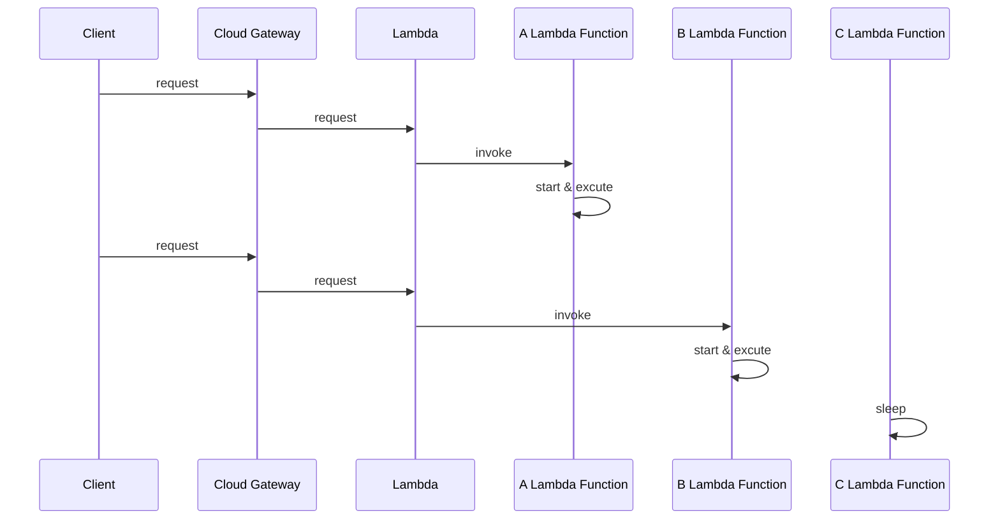

# Deploy NextJS lên cloud - so sánh AWS EC2 và serverless (lambda)

### 🍌 Phân tích vấn đề

#### 😎 NextJS

[NextJS](https://nextjs.org/) là 1 framework khá phổ biến, đặc thù của nó là có thể [deploy 1 web ở nhiều chế độ](https://theodorusclarence.com/blog/nextjs-fetch-method):

*   CSR - Client-Side Rendering
    
*   SSR - Server-Side Rendering
    
*   SSG - Static Site Generation
    
*   ISR – Incremental Static Regeneration, kết hợp giữa SSG và SSR
    

Bài toán đặt ra là làm sao cho việc deploy:

*   tốn ít tài nguyên cloud nhất có thể
    
*   tốn ít công setup, config và maintain nhất có thể
    

Do NextJS được tạm chia thành 3 phần:

*   Phần tĩnh chỉ cần trả về client mà không cần xử lý data gì thêm - bao gồm thư mục `/static`, `/public`, `/_next`, `/static-pages`
    
*   Phần động có xử lý dữ liệu liên quan tới SSR, thông thường là sử dụng `getServerSideProps`
    
*   Phần động có xử lý dữ liệu liên quan tới API routes, nằm trong thư mục `api/*`
    

Như vậy, phần tĩnh thì ta có thể để trên AWS S3, phần động thì chạy trên AWS lambda. Sau đây là cơ chế cơ bản của lambda - event-driven - hướng sự kiện:

#### 👷 Giới thiệu AWS lambda


Gọi lambda là event-driven service vì nó có cơ chế có sự kiện gọi tới - invoke thì mới chạy. Đặc tính thứ 2 là stateless - "Không phụ thuộc vào trạng thái", đơn giản là nó tập trung vào xử lý task cần làm. Dữ liệu hay trạng thái nếu có thì cần request từ dịch vụ khác như DB, API bên thứ 3... Hơn nữa sau 1 khoảng thời gian không hoạt động thì nó sẽ được tự động tắt đi, như hình sau:


Việc bật bên rồi tắt đi này gọi là gọi là "reserved concurrency" (xem trong ảnh trên). Ngược lại, nếu có request thì nó tiếp tục được tái sử dụng để xử lý request, gọi là "provisioned concurrency" (xem trong ảnh trên).

Lambda thường là 1 bộ phận quan trọng với kiến trúc serverless, kiến trúc này sẽ được giới thiệu sau đây.

Tuy nhiên có 1 cách truyền thống đó là sử dụng 1 EC2 instance, nên ta sẽ so sánh 2 cách này với nhau.

### 🌙 Về kiến trúc - architecture cơ bản

#### **Server truyền thống**


Những sever instance này chứa API logic xử lý data hoặc cả static resource, xử lý 24/7 ngay cả khi không có request. Giống như "người phục vụ" 24/7 dưới đây:


Sự lãng phí resource ở đây chính là chỗ này. Giống như khi không có request mà "người phục vụ" vẫn phải thức cả đêm ở nhà hàng. Nhưng cái được ở đây đó là "người phục vụ" luôn luôn sẵn sàng "phục vụ" khách hàng.

Tuy nhiên, sự lãng phí này chỉ thực sự xảy ra khi "mức độ xử dụng dịch vụ" là biến thiên rõ rệt theo dòng thời gian.


**Trục X**: dòng thời gian.

**Trục Y**: "mức độ xử dụng dịch vụ".


Còn mức độ xử dụng dịch vụ - số lượng requests mà tương đối ổn định thì việc duy trì 1 nhóm "nhân viên" phục vụ 24/7 trong cử hàng trên là hiệu quả.

#### Serverless


Hoặc vẽ theo Sequence Diagram:


Trong biểu đồ trên, "invoke" có thể dịch là "gọi tới".

Trong trường hợp trên nếu không có request "đủ nhiều" thì không cần gọi tới "C Function" - "người phục vụ" dậy để phục vụ. Còn "A Function" và "B Function" đang phục vụ request gửi tới.

Các lambda Function - người phục vụ này được cloud quản lý và có thể shared giữa các dự án nên tối ưu hóa được nguồn lực.

Như vậy, ở đây "người phục vụ" hoạt động trên nguyên tắc "cần thì mới phục vụ", không có ai gọi tới thì có thể ngủ hoặc phục vụ ở 1 dự án khác. Cơ chế này rất quen thuộc với chúng ta giống như trong "lazy-load" component bên FrontEnd vậy.


Vì đặc tính "lazy-load" này nên trước "cửa hàng" bên trên, số người phục vụ 24/7 không còn nữa, tương đồng với ý nghĩa "không còn ai phục vụ nữa" hay "phi máy chủ" của từ "serverless".

Vấn đề là tất cả cùng ngủ thì lấy ai phục vụ??

Tất nhiên là khi có request đến, Lambda Function phải khởi chạy từ đầu. Cái này gọi là "**Cold ❄️ Start Issues**". Tham khảo thêm cách "**Keeping Functions Warm**" tại:

*   [serverless - Keeping Functions Warm - How To Fix AWS Lambda Cold Start Issues](https://www.serverless.com/blog/keep-your-lambdas-warm)
    
*   [dashbird - What can improve startup latency?](https://www.serverless.com/blog/keep-your-lambdas-warm)
    

Dưới đây là "vòng đời" - lifecycle của 1 lambda function:


Ảnh từ [Lambda execution environment lifecycle](https://docs.aws.amazon.com/lambda/latest/dg/lambda-runtime-environment.html).


[Operating Lambda: Performance optimization – Part 1](https://aws.amazon.com/blogs/compute/operating-lambda-performance-optimization-part-1/)

Ta có thể thấy kể từ khi nhận được 1 request chạy lambda function thì giai đoạn "cold start" là khoảng thời gian mà function chưa thể thực thi được code. Còn 1 đặc điểm nữa mà Lambda khác biệt so với EC2 đó là trong khi nhận 1 request thì 1 lambda function được coi là đang "bận", nó sẽ không nhận thêm request như với EC2. Nguyên tắc là mỗi 1 event - 1 request chỉ chạy trên 1 lambda function. Điều đó giúp lambda function giữ được tính đơn giản.

Như vậy đối với mức độ sử dụng dịch vụ thường xuyên không mấy biến thiên, ổn định thì rõ ràng EC2 hiệu quả hơn, vì nó không mất thời gian Cold start.

Ở đây ta có thể kết luận rằng tùy từng trường hợp thì serverless mới trở nên hiệu quả, không có phương pháp nào là tối ưu trong mọi trường hợp. Tùy từng trường hợp ta sẽ quyết định dùng serverless hay không.

Cụ thể kiến trúc serverless ta có thể tham khảo dưới đây:

*   [serverless-nextjs blog](https://www.serverless.com/blog/serverless-nextjs)
    
*   [Terraform Next.js module for AWS - github](https://github.com/milliHQ/terraform-aws-next-js)
    


Ảnh từ [serverless-next.js github](https://github.com/serverless-nextjs/serverless-next.js).


Ảnh từ [Terraform Next.js module for AWS - github](https://github.com/milliHQ/terraform-aws-next-js).

### 🛖 Số lượng connection tới DB nếu có

Với serverless, sẽ xuất hiện hiện tượng tăng số lượng connection tới DB (mỗi function sẽ là 1 connection) vì số lượng function connect tới là rất lớn.

Ngược lại, với EC2, 1 instance sẽ chỉ mở 1 số connection pool nhất định tới DB. Vì vậy với EC2 ta không cần quá lo lắng tới giới hạn [connection pool size](https://dev.mysql.com/doc/connector-net/en/connector-net-connections-pooling.html) như với MySQL.

Tham khảo thêm cách tính số lượng [connection pool size với Prisma](https://www.prisma.io/docs/concepts/components/prisma-client/working-with-prismaclient/connection-pool#connection-pool-size).

Như vậy quá 1 ngưỡng nhất định thì DB sẽ hạn chế request tới, trả về lỗi, để đảm bảo hiệu quả hoạt động.


Để tránh tình trạng request tới DB quá lớn vượt ngưỡn thì người ta nghĩ ra 1 proxy đứng giữa, bắt các request tới sau, quá đông thì xếp hàng đợi. Ví dụ với Prisma là [Database Access in Serverless Environments with the Prisma Data Proxy](https://www.prisma.io/blog/prisma-data-proxy-xb16ba0p21)


### 🐪 Với NextJS API routes

[NextJS API routes](https://nextjs.org/docs/api-routes/introduction) cho phép build **API** with NextJS.

Tuy nhiên, nếu API không dùng tiện ích mà API routes mang lại, đó là đơn giản, nhanh, tiện thì việc viết tách riêng API ra khỏi NextJS, cũng có ưu điểm. Đó là việc [warming up of serverless được cải thiện](https://stackoverflow.com/questions/67358959/should-i-develop-a-separate-express-server-or-handle-all-api-calls-in-my-next-j), ta còn có thể sử dụng [AWS SAM - Serverless Application Model framework](https://dev.to/aws-builders/building-serverless-with-sam-396o) tối ưu với lambda. Hay trải nghiệm coding với Backend Framework với độ chuyên môn hóa cao hơn, khó mà NextJS API routes thay thế được. NextJS API routes chỉ phù hợp với số lượng nhỏ API, đơn giản.

### 🏃‍♀️ Giới hạn số lượng request được sử dụng xử lý đồng thời

Để hiểu thêm về cơ chế xử lý các request đồng thời ta xem thêm tại [lambda concurrency - throttling behavior](https://docs.aws.amazon.com/lambda/latest/dg/lambda-concurrency.html#throttling-behavior).


Số lượng Lambda function trong 1 region là giới hạn. Hiện tại default là 1000, có thể config để up to 10k là tối đa (con số có thể được thay đổi về sau này), Tham khảo con số này tại [đây](https://docs.aws.amazon.com/lambda/latest/dg/gettingstarted-limits.html) Ví dụ với ảnh bên trên, số lượng function tối đa là 6 (có 6 function được init) thì số lượng request được xử lý tối đa cũng là 6, còn trong suốt quá trình chạy thì có thể xử lý tất cả là 10 request. Với mỗi request là 1 lần "invoke".

Chính vì thế mà đối với service nào cần nâng mức chịu tải lên quá lớn thì không làm được. Ví dụ như có 1 dự án được thực hiện test performance 20k request tới cùng 1 lúc thì không chịu nổi - có nhiều request sẽ bị lỗi hoặc quá timeout. Bỏ serverless đi, dùng EC2 thì nâng độ chịu tải lên được 50k request. Tuy con số là tương đối phụ thuộc vào mức độ phức tạp của logic và sự phụ thuộc service bên thứ 3, sự phụ thuộc càng lớn thì số request tối đa càng nhỏ dần, nhưng mình cũng lấy đó tham khảo.

Tất nhiên, ở những dự án không yêu cầu giới hạn số lượng truy cập cao thì không cần phải support số lượng request lớn như vậy.

Vì vậy, cần thiết phải estimate - ước chừng số lượng request đồng thời tương ứng với business logic, trước khi quyết định dùng serverless hay không. Tránh trường hợp phải "đập đi xây lại" dự án, vì cấu trúc source-code cũng bị ảnh hưởng bởi kiến trúc serverless.

### ⚠️ Chú ý với logic code gọi tới dịch vụ khác

Tương tự với việc kết nối tới DB, việc sử dụng dịch vụ khác bên thứ 3 hoặc ngay trong AWS như AWS Batch, cần chú ý hạn chế số lượng, thứ tự khi gọi.

### 🧭 Dịch vụ nào kèm theo đối với AWS

#### 📖 Với việc ghi log

*   **Server truyền thống:**
    

Cách dùng server truyền thống với EC2 thì có thể không dùng CloudWatch Log để lưu và quản lý log. Nếu vậy thì sẽ phải định kỳ vào EC2 xóa log, hoặc dùng `CrontJob` để xóa.

*   **Serverless:**
    

Bởi vì khi API chạy trên Lambda Function thì không thể ghi log ra Function đang chạy được. Do mỗi Function - môi trường chạy là "động" nên cứ ghi ra thì có thể mất và khó kiểm soát. Như vậy, việc sử dụng [AWS CloudWatch Logs](https://docs.aws.amazon.com/AmazonCloudWatch/latest/logs/WhatIsCloudWatchLogs.html) là gần như bắt buộc. Tham khảo thêm tại [serverless CloudWatch Log docs - Simple event definition](https://www.serverless.com/framework/docs/providers/aws/events/cloudwatch-log).

#### 🎄 Process manager

*   **Server truyền thống:**
    

Ta có thể sử dụng [pm2 với custom log](https://loclv.hashnode.dev/deploy-to-the-server-with-pm2-and-custom-log) và [cluster mode](https://pm2.keymetrics.io/docs/usage/cluster-mode/) để tối ưu hiệu quả hoạt động bằng việc tận dụng số nhân CPU và giảm downtime.

*   **Serverless:**
    

Không cần Process manager, do AWS lambda quản lý, xem thêm [Lambda execution environment lifecycle](https://docs.aws.amazon.com/lambda/latest/dg/lambda-runtime-environment.html).

#### 🧊 Lưu trữ static resource - file tĩnh với S3

Cả EC2 và Lambda đều có thể sử dụng S3, tuy nhiên EC2 có thể không dùng còn Lambda thì gần như bắt buộc, vì Lambda chỉ cung cấp môi trường thực thi Function. Lambda cũng không thể lưu trữ quá nhiều dữ liệu tĩnh và không tối ưu đối với loại data này.

#### 🕸️ CloudFront - Content Delivery Network (CDN) in edge locations

CloudFront là hệ thống truyền tải data thông qua các Data center gần với user nhất có thể, đồng thời lưu lại cache để tối hóa tốc độ truyền tải, giảm thiểu số lượng request trùng lặp dựa vào cache.


[stackoverflow - when-to-use-amazon-cloudfront-or-s3](https://stackoverflow.com/questions/3327425/when-to-use-amazon-cloudfront-or-s3)

Trên là trường hợp user từ EU và US được phân hóa và có truy cập nhanh hơn, khi có CloudFront mà không trực tiếp truy cập vào S3.


[What is Cloudfront? | When to use CDN in AWS?](https://youtu.be/namCH3nzU8k)


[https://aws.amazon.com/blogs/aws/aws-asia-pacific-osaka-region-now-open-to-all-with-three-azs-more-services/](https://aws.amazon.com/blogs/aws/aws-asia-pacific-osaka-region-now-open-to-all-with-three-azs-more-services/)

Với ví dụ trên, Osaka gần Nagoya hơn Tokyo, nên Latency - độ trễ thấp hơn Tokyo.

Câu hỏi đặt ra là ví dụ 1 dịch vụ chỉ cung cấp cho Nhật Bản chẳng hạn thì có còn cần thiết hay không? Ta phải tìm hiểu sâu hơn về Edge locations - "vùng biên".


[The Infrastructure of AWS Asia Pacific (Osaka) Region](https://aws.amazon.com/local/osaka-region/)

Amazon CloudFront sử dụng "Points of Presence" - "điểm hiện tại" bao gồm cả Edge locations và các regional. Ví dụ Osaka và Tokyo là 2 region thì mỗi region lại có nhiều Edge locations. Như vậy, chỉ cung cấp dịch vụ cho Nhật Bản thì vẫn cần thiết sử dụng CloudFront, không riêng gì EC2 hay Lambda.

`Lambda@Edge` là dịch vụ của CloudFront giúp ta chạy code "gần" người dùng hơn, giúp tối ưu độ trễ.

### 🏘️ Source code structure

#### **severless**

Với API, có thể source code của chúng ta phải tổ chức lại, ví dụ sử dụng [AWS SAM - Serverless Application Model framework](https://dev.to/aws-builders/building-serverless-with-sam-396o).

> The AWS Serverless Application Model (AWS SAM) is an open-source framework that you can use to build [serverless applications](https://aws.amazon.com/serverless/) on AWS.

Xem thêm về [Tutorial: Deploying a Hello World application using AWS SAM](https://docs.aws.amazon.com/serverless-application-model/latest/developerguide/serverless-getting-started-hello-world.html).

Chính vì kiến trúc ảnh hưởng tới source code bên API, nên ta nên quyết định theo kiến trúc nào ngay từ đầu, dựa trên yêu cầu ban đầu.

Còn với phần Frontend thì đã được [AWS Amplify](https://aws.amazon.com/amplify/) hỗ trợ rồi, nên ta không phải lo lắng với NextJS.

> With the latest release, the Amplify JavaScript libraries add [additional features](https://docs.amplify.aws/lib/ssr/q/platform/js) that further enable developers to build SSR apps using modern web frameworks like Next.js and Nuxt.js with major enhancements to the REST API, GraphQL API, Auth, and DataStore categories.

Việc tái cấu trúc lại source code này cũng không cần lo lắng khi sử dụng [serverless-next.js](https://github.com/serverless-nextjs/serverless-next.js).

Đối với NextJS phiên bản mới, thời điểm hiện tại là NextJS 13 thì:

*   AWS Amplify đã hỗ trợ, xem thêm blog: [Deploy a Next.js 13 app to AWS with Amplify Hosting](https://aws.amazon.com/blogs/mobile/amplify-next-js-13/).
    
*   [**serverless-next.js**](https://github.com/serverless-nextjs/serverless-next.js) **có vẻ đã ngừng maintain qua** [thông báo này](https://github.com/serverless-nextjs/serverless-next.js/discussions/2439), nên tốt nhất là không nên dùng [**serverless-next.js**](https://github.com/serverless-nextjs/serverless-next.js) **nữa**! NextJS 13 đã có bundler mới, [không còn dùng webpack nữa](https://nextjs.org/blog/next-13), nên xảy ra nhiều issue ví dụ [serverless-next.js/issues/2497](https://github.com/serverless-nextjs/serverless-next.js/issues/2497)
    
*   [serverless-stack/sst](https://github.com/serverless-stack/sst) - tool build full-stack serverless applications on AWS. [serverless-stack/sst](https://github.com/serverless-stack/sst) khi sử dụng thì có cảm giác khá khó config, không được như [terraform](https://www.terraform.io/). Còn riêng cho NextJS là [jetbridge/cdk-nextjs](https://github.com/jetbridge/cdk-nextjs), tool này sử dụng `AWS CDK` để tương tác với các dịch vụ AWS. Hiện tại mình cũng chưa thử dùng [jetbridge/cdk-nextjs](https://github.com/jetbridge/cdk-nextjs), nên chưa thể đánh giá được!
    
*   [milliHQ/terraform-aws-next-js](https://github.com/milliHQ/terraform-aws-next-js) cũng không còn support phiên bản mới nữa. Xem thêm tại [issue này](https://github.com/milliHQ/terraform-aws-next-js/issues/372). Thay vào đó ta nên tự sử dụng [terraform](https://www.terraform.io/) để tạo mới dự án từ đầu, tuy vất vả hơn nhưng dễ dàng custom!
    

* * *

#### **server truyền thống**

Còn với EC2 thì tất nhiên cấu trúc source code là flexible nhất có thể rồi.

### 📈 Về monitoring - giám sát hoạt động

**Những điểm khác biệt:**

[Monitor Amazon EC2](https://docs.aws.amazon.com/AWSEC2/latest/UserGuide/monitoring_ec2.html) từ bên ngoài, có thể là kiểm tra CPU, network. Từ bên trong sâu hơn ta có thể dùng logger module bên trong service, kết hợp [PM2 custom log](https://loclv.hashnode.dev/deploy-to-the-server-with-pm2-and-custom-log) và [sử dụng CloudWatch Logs agent](https://docs.aws.amazon.com/AmazonCloudWatch/latest/logs/QuickStartEC2Instance.html).

Còn đối với AWS lambda, ta sử dụng [Lambda function metrics](https://docs.aws.amazon.com/lambda/latest/dg/monitoring-metrics.html) kết hợp CloudWatch để alert khi vượt những ngưỡng giới hạn mà ta đặt ra. Ví dụ như khi Lambda chạy lỗi sẽ log ra các thông tin với các level khác nhau (info, warning, error, fatal...). Vì đặc thù lambda giúp ta không cần quan tâm tới quá sâu tới môi trường chạy, như các chỉ số CPU, network, nên ta chỉ cần quan tâm xem lambda function có chạy lỗi hay không thôi. Nhưng vì số lượng AWS lambda function lớn, số lượng này là giới hạn, nên cần quản lý các metrics - chỉ số về số lượng function được invoke quá mức chẳng hạn.

**Những điểm giống nhau:**

Cả 2 loại server truyền thống và serverless đều sử dụng chung cấu trúc [logging level](https://sematext.com/blog/logging-levels/):

*   **TRACE**
    
*   **DEBUG**
    
*   **INFO**
    
*   **WARN**
    
*   **ERROR**
    
*   **FATAL**
    

Khi muốn tìm kiếm, phân loại log ta đều cần [CloudWatch Logs Insights query syntax](https://docs.aws.amazon.com/AmazonCloudWatch/latest/logs/CWL_QuerySyntax.html).

### 🚀 Giá cả

Giá ngày 14/12/2022.

#### 🕸️ CloudFront


Estimate trên tương ứng với 1 triệu - 1\_000\_000 request, 1GB data tranfer ra ngoài internet và 1GB tới dịch vụ gốc của chúng ta.

#### 🏕️ EC2 - 1 instance

EC2 - linux - t3a.medium - 2 vCPUs - 4 GiB Memory with 50 GB SSD tại Asia Pacific (Tokyo):


Giá là 28.48 USD hàng tháng - 341.76 USD 1 năm.

Tất nhiên là nếu nhu cầu của mình càng nhỏ thì chi phí càng nhỏ.

Với config như trên, nhưng thử hạ xuống t4g.nano - 2 vCPUs - 0.5 GiB Memory with 5 GB SSD thì giá sẽ là 3.08 USD 1 tháng!

#### Serverless

Lambda với cấu hình khá thấp, 100\_000 request per month...:


Thì giá thành là **Total Monthly cost:** 1.94 USD.

`Lambda@Edge`:


Với estimate trên (100\_000 request per month) thì **Lambda@Edge costs (monthly): 1.94 USD**.

Rủi ro về giá của **Lambda** là việc dịch vụ có khi còn đắt hơn cả 1 instance EC2 khi mức độ yêu cầu về memory, số lượng request và "Provisioned Concurrency". Provisioned Concurrency là tính năng khởi tạo và chuẩn bị sẵn sàng cho request gọi tới, giúp serverless giải quyết vấn đề cold start. Giá phía trên là chưa bao gồm Provisioned Concurrency.

Việc setup Provisioned Concurrency với số lượng lớn function được chạy đồng thời và thời enabled lớn, thì còn tốn resource hơn cả việc bạn bật số lượng nhỏ EC2 liên tục.

### 🤢Tổng hợp nhược điểm của serverless

Ưu điểm thì ta thấy rõ là ở 1 chừng mực nào đó, giá cả AWS lambda là rẻ hơn, việc scale-up service cũng sẽ tự động 1 phần nào đó. Tuy nhiên đánh đổi lại, ta sẽ nhìn lại các nhược điểm như sau:

*   Source-code thường cần phải có cấu trúc khác biệt so với truyền thống, nên thiết kế hệ thống ngay từ đầu đã phải lên kế hoạch cho serverless, tránh việc code xong rồi mới quyết định thì sẽ phải sửa code. Nếu phụ thuộc vào các serverless framework thì cũng có rủi ro không được support đầy đủ, ví dụ như NextJS phiên bản mới.
    
*   Deploy tốn thời gian hơn vì có nhiều thành phần và ta phải quan tâm tới việc giới hạn ngưỡng của lambda.
    
*   Tốn thời gian tìm hiểu và maintain hơn vì phải quản lý số lượng Lambda function đồng thời được invoke.
    
*   Có thể vẫn phải sử dụng kết hợp EC2 vì các yêu cầu về lượng truy cập (request) tới cùng 1 thời điểm quá lớn.
    
*   Việc Cold starting sẽ ảnh hưởng tới thời gian trả về response, mà muốn giải quyết bài toán này lại cần config và tìm hiểu về cơ chế warm up function.
    
*   Việc [config CPU và memory cho lambda](https://stackoverflow.com/questions/66522916/aws-lambda-memory-vs-cpu-configuration), thì khó khăn hơn EC2. Hiện tại, chưa thấy có hỗ trợ số vCPU &gt; 10. Vì vậy tác vụ quá nặng yêu cầu cấu hình cao hay GPU thì không nên sử dụng.
    
*   Đối mặt với các rủi ro về giới hạn số lượng connection tới DB hay các service bên thứ 3.
    
*   Xử lý queue, callback với nhiều lambda funtion bấy đồng bộ thì khó khăn hơn là viết queue nằm trong 1 cục source code bên trong EC2.
    
*   Muốn build ứng dụng chat realtime sử dụng web-socket thì ta cần [sử dụng với AWS API Gateway](https://tsh.io/blog/implementing-websocket-with-aws-lambda-and-api-gateway/).
    

### Phụ lục

`mermaid` Diagram code:

*   Server truyền thống
    

````markdown
```mermaid
graph LR
Client[Client side] -- request static resource like static page, image... --> Server{One or more server instance}

Client -- request API --> Server

Server -- send response including API response or static resource --> Client
````

*   serverless
    

````markdown
```mermaid
graph LR

Gateway{Cloud Gateway}
AFunction(A Function)
BFunction(B Function)

AClient[A Client side] -- request --> Gateway
Gateway -- return --> AClient

Gateway --> AFunction

BClient[B Client side] -- request --> Gateway
Gateway -- return --> BClient

Gateway --> BFunction

CFunction(C Function) -- sleep --> CFunction
```


````

Vẽ hình bằng:

*   [sketch.io/sketchpad](https://sketch.io/sketchpad/)
    
*   Create smart AWS diagrams with [cloudcraft.co](https://www.cloudcraft.co/)
    
*   [Mermaid lets you create diagrams and visualizations using text and code.](https://mermaid-js.github.io/mermaid/#/)
    

### ✈️ Tham khảo

*   [stackoverflow - cheapest-way-to-deploy-a-react-app-using-nextjs-ssr-on-aws](https://stackoverflow.com/questions/61433306/cheapest-way-to-deploy-a-react-app-using-nextjs-ssr-on-aws)
    
*   [https://blog.bitsrc.io/why-aws-love-next-js-1f7b6491857](https://blog.bitsrc.io/why-aws-love-next-js-1f7b6491857)
    
*   [https://www.sentiatechblog.com/aws-re-invent-2020-day-3-optimizing-lambda-cost-with-multi-threading?utm\_source=reddit&utm\_medium=social&utm\_campaign=day3\_lambda](https://www.sentiatechblog.com/aws-re-invent-2020-day-3-optimizing-lambda-cost-with-multi-threading?utm_source=reddit&utm_medium=social&utm_campaign=day3_lambda)