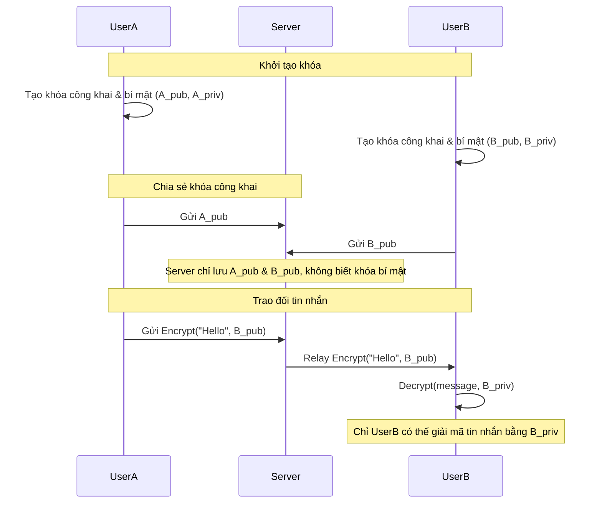

Dưới đây là một sơ đồ Mermaid mô tả kiến trúc của một ứng dụng chat với mã hóa đầu-cuối (end-to-end encryption), đảm bảo chỉ người dùng mới có thể đọc tin nhắn:



Code biểu đồ:

````markdown

````

Sơ đồ này mô tả:

* Mỗi người dùng tạo cặp khóa riêng (public/private).
* Chỉ chia sẻ khóa công khai qua server.
* Tin nhắn được mã hóa bằng khóa công khai người nhận, chỉ có thể giải mã bằng khóa bí mật người nhận.
* Server chỉ trung chuyển dữ liệu đã mã hóa, không thể giải mã.

