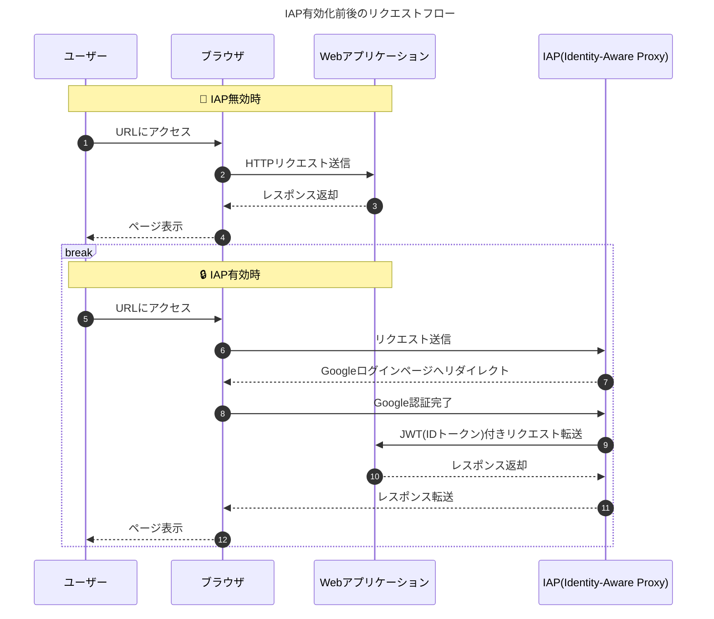

内容はChatGPTで情報をまとめしました。

GCP IAPのドキュメント: <https://cloud.google.com/security/products/iap?hl=en>.

## 🔐 IAPとは何か

IAP（Identity-Aware Proxy） は、Google Cloud が提供するセキュリティサービスで、アプリケーションや API へのアクセスを制御する ためのものです。
アプリケーション側でログイン機能を実装しなくても、Google アカウントや SSO で認証・認可を行うことができます。

⸻

## 🧩 基本的な仕組み

	1.	ユーザーが IAP で保護された URL にアクセスする。
	2.	IAP がリクエストを一旦ブロックし、ユーザーに Google アカウントでログイン させる。
	3.	認証が完了すると、IAP はユーザー情報を含む JWT（ID トークン） を付与してバックエンドにリクエストを転送する。
	4.	バックエンド側ではこのトークンを検証し、誰がアクセスしているかを確認できる。

👉 つまり、アプリ側で独自のログイン機能を作る必要がありません。

⸻

## IAP を有効にする前後のリクエストフロー図

こちらは Mermaid で描ける IAP 有効化前後のリクエストフロー図です👇



Source:

```text

```

## ⚙️ なぜ IAP はインフラを複雑にするのか

IAP はセキュリティを高めますが、その分インフラ構成が複雑になります。主な理由は以下の通りです。
	1.	ロードバランサが必須
	•	IAP は HTTPS ロードバランサ 経由でしか動作しません。
（VM・Cloud Run・GKE サービスに直接設定はできません）
	•	そのため、URL マップ、バックエンドサービス、証明書、ドメイン、ファイアウォールなどの設定が必要になります。
	2.	トークン検証が必要
	•	バックエンド側で IAP の JWT を検証しないと、内部からの不正アクセスを防げません。
	•	ミドルウェアやライブラリで検証ロジックを追加する必要があります。
	3.	CI/CD が複雑になる
	•	アプリのデプロイだけでなく、IAP の設定（OAuth クライアント、IAM 権限など）も環境ごとに管理しなければなりません。
	4.	デバッグが難しい
	•	リクエストが Google のプロキシを経由するため、403 や 401 エラーの原因を特定しづらい。
	•	IAP ログ、ロードバランサログ、アプリログをすべて確認する必要があります。
	5.	ローカル開発・テストが面倒
	•	ローカル環境では IAP 認証を簡単に通すことができず、トークンのモックやバイパス設定が必要です。
	•	ステージングで IAP を無効化する設定を入れると、管理ミスにつながることもあります。

⸻

## 💡 IAP を使うべき場合・避けるべき場合

✅ 使うべき場合
	•	社内ツールや管理画面など、内部向けアプリ を守りたい場合。
	•	独自のログイン機能を作りたくない場合。
	•	すでに Google Workspace / Cloud Identity を利用している場合。

❌ 避けるべき（または慎重に検討すべき）場合
	•	一般ユーザー向け（外部公開）のアプリの場合（Google ログイン限定になる）。
	•	簡易的な開発・検証環境の場合。
	•	ロードバランサを使っていない小規模インフラの場合。

⸻

## まとめ

メリット	デメリット
強力なセキュリティ、IAM との統合	ロードバランサ必須で構成が複雑
ログイン機能の実装不要	ローカル・ステージング環境で面倒
ユーザー／グループ単位で権限管理可能	デバッグや CI/CD が難しくなる

